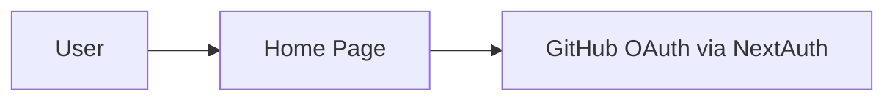

### Added Section
# Platform Architecture Overview

This repository snapshot is a minimal Phase 0 foundation: a Next.js application with NextAuth GitHub OAuth and a defined Prisma schema. There are no background workers, batch pipelines, or decision-intelligence services implemented.

ASCII overview:

[User]
  |
  v
[Next.js App (UI + API)] ---> [NextAuth GitHub OAuth]
  |
  v
[Prisma Schema Definition] (schema only; no runtime DB access in code)

Mermaid (current snapshot):

```mermaid
graph TD
  U[User] --> A[Next.js App]
  A --> O[NextAuth GitHub OAuth]
  A --> H[/api/health]
  A --> S[Prisma schema only]
```

Why this design:
- Single-process UI/API reduces operational complexity in Phase 0.
- OAuth via NextAuth provides a secure baseline without custom auth.
- Prisma schema defines the canonical data model for later phases.

### Added Section
# Analytics Modernization Flow

The full modernization flow (Discovery → Intelligence → Decision → Validation → Optimization) is not implemented in this repo snapshot. The only implemented flow is authentication and a basic home page session check.

Mermaid (implemented flow):



### Added Section
# Validation & Trust Architecture

Deterministic validation gates, audit logs, snapshot comparisons, and deployment gates are not implemented in this repository snapshot. These are out of scope for the current codebase state.

### Added Section
# Scalability & Reliability

Current characteristics:
- Stateless Next.js server process (no in-app background jobs).
- No batch processing or idempotent workflows implemented.
- Failure isolation is limited to standard Next.js request handling.

These constraints are intentional for Phase 0 and should be revisited only when corresponding features are implemented.
